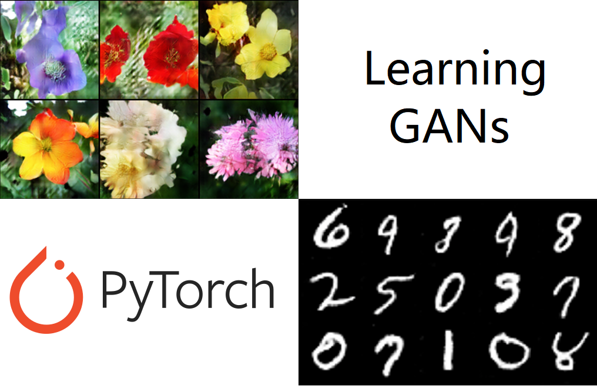
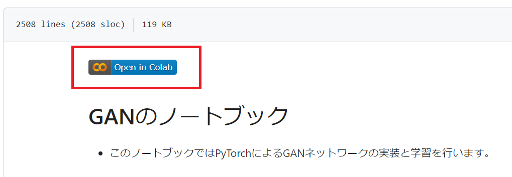

# PyTorchで学ぶ！敵対的生成ネットワーク(GAN)の基礎

by Yuichi Hirayama

## githubに以下のセクションで用いるソースコードを格納しています。
- セクション4:GAN
 
- セクション5-1:DCGAN モノクロ手書き数字画像
 
- セクション5-2:DCGAN カラー花画像
 
- セクション6:Conditional GAN

## 使い方
各ノートブックを開いたのち
open in colabのリンクをクリックしてgoogle colaboratory上で実行

